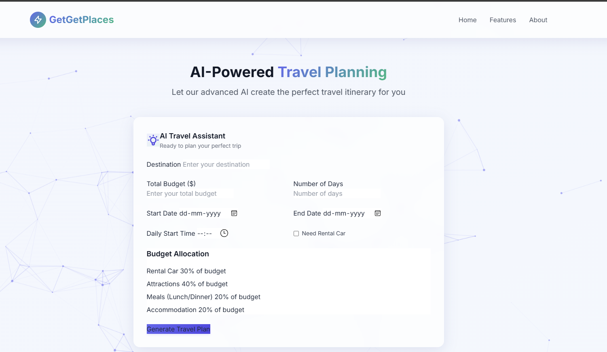

# ✈️🚙🏨GetGetPlaces - From idea to itinerary — AI-crafted travel made effortless.

Your personal AI agent to plan smart, weather-aware, budget-friendly trips — effortlessly.

## ⭐ Features
- **Natural Language Understanding** — Just tell it: “Plan a 5-day Miami trip with $1500 for food & beaches”
- **Dynamic Weather Check** — Real-time forecasts from OpenWeatherMap
- **Distance & Travel Time Calculation** — Smart routing between attractions
- **AI-Powered Itinerary** — Personalized daily plans with hotels, restaurants, and must-visit spots
- **Price Prediction** — ARIMA-based future price forecasts
- **Intelligent Recommendations** — Machine learning model for tailored suggestions
- **Database-Ready** — PostgreSQL backend for trips, users, hotels & cars
# Homepage

## 🚀 Example

“Plan a 7-day Orlando & Miami trip with $3000 budget, focus on museums and great food”

And you get back:
- Day-wise schedules
- Attractions & restaurant timings
- Weather-based suggestions
- Car pick-up & drop-off details
- Price breakdown

## 📈 Coming Soon
- Reinforcement Learning optimization
- Live flight price prediction
- Web-based UI

## License

MIT License
